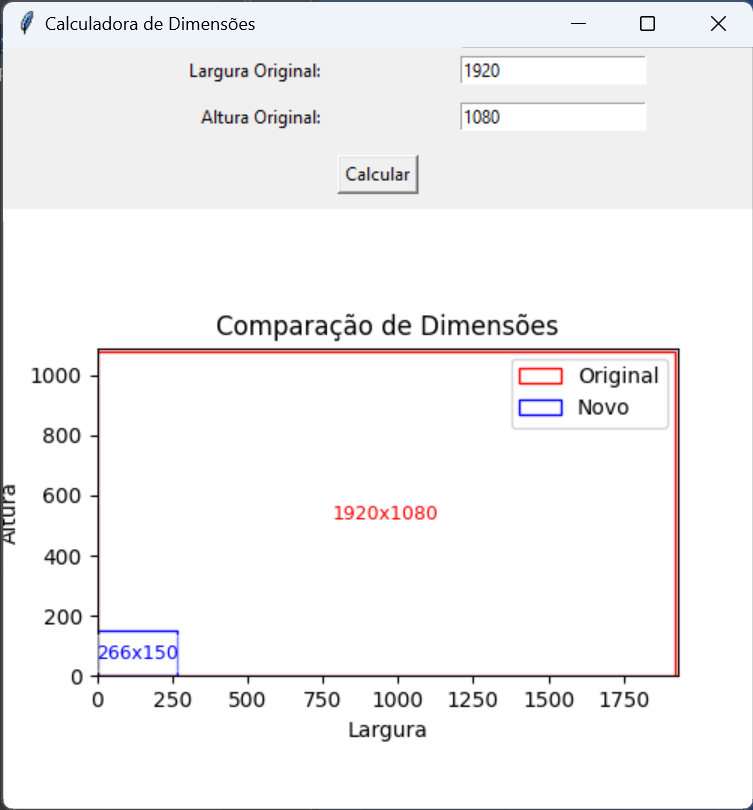

# Calculadora de Dimensões de Imagem
Este repositório contém duas implementações de uma ferramenta para calcular novas dimensões de uma imagem, mantendo o mesmo aspect ratio, de modo que o número total de pixels não exceda um valor máximo definido.

### Implementação em linha de comando: 
#### Uso
1. Execute o arquivo `main.py`.
2. Forneça a largura e altura originais da imagem quando solicitado.
3. O programa retornará as novas dimensões recalculadas.
4. Você pode continuar fornecendo novos conjuntos de dimensões ou sair do programa conforme desejar.

`main.py` mostrará a seguinte saída:
```bash
$ python main.py
```
```
Insira a largura original: 1920
Insira a altura original: 1080
As novas dimensões são: 266 x 150
Deseja inserir novas dimensões? (s/n): 
```

### Interface Gráfica
#### Requisitos
- tkinter
- matplotlib
Você pode instalar essas dependências usando o seguinte comando:
```bash
pip install tk matplotlib
```

#### Uso
1. Execute o arquivo `calculadora_dimensoes_gui.py`.
2. Uma janela gráfica será aberta. Insira a largura e altura originais da imagem nos campos fornecidos.
3. Clique no botão "Calcular".
4. O programa exibirá um gráfico comparativo das dimensões originais (em vermelho) e das novas dimensões (em azul).
5. Você pode continuar fornecendo novos conjuntos de dimensões ou sair do programa conforme desejar.



## Autor

Este projeto foi desenvolvido por [Jefferson Rosa](https://github.com/jeffersonrosa/).

## Licença

Este projeto está licenciado sob a Licença MIT - veja o arquivo [LICENSE](LICENSE) para detalhes.
